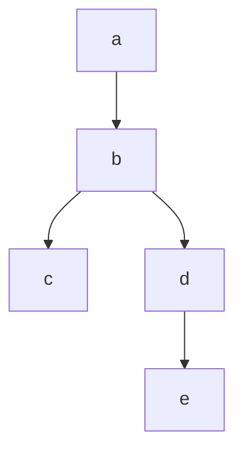
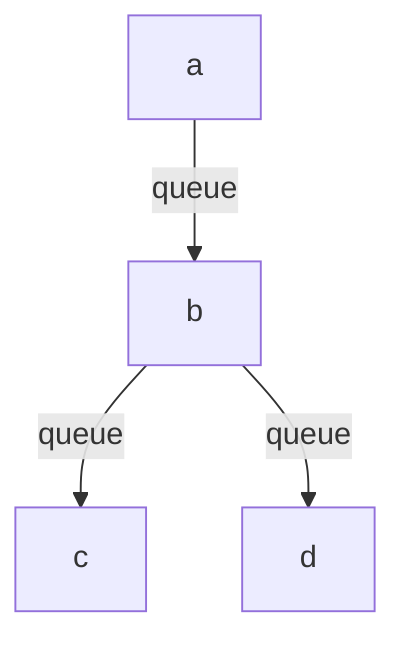
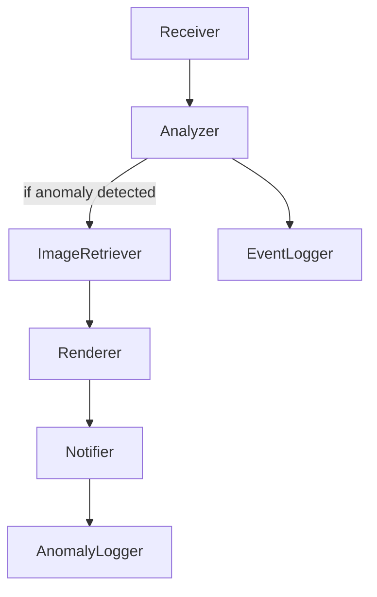
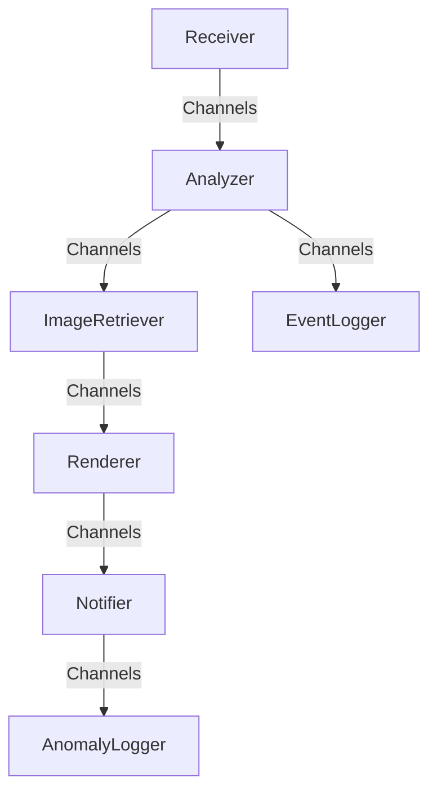

# Building Async Streaming Pipelines using Channels in C#

## Table of Contents 
  - [TL;DR](#tldr)
  - [Problem Statement](#problem-statement)
  - [Monolithic Solution](#monolithic-solution)
  - [Channels](#channels)
  - [Implementation](#implementation)
  - [IRL](#irl---in-real-life)
  - [Alternate Design](#alternate-design)
  - [Source Code Structure](#source-code-structure)
  - [References](#references)

## TL;DR

If we are looking tp build an in-memory messaging system with pub-sub, thread-safety and super fast, then think Channels :). Piqued, want to know more ? Read on ... 

## Problem Statement

Let's say we are tasked to build a program/service, which reads data from any event stream, streaming millions of events over a day. Every event has to go through a series of steps where each step takes an indeterministic amount of time to complete and data from every step is input to the next. To make it a bit more complex, let's say downstream steps follows a pattern like a Direct Acyclic Graph (DAG) and need to be configurable. e.g. 


The node paths should configurable.

How do we go about it ?

## Monolithic Solution

We could start writing a monolith. By monolith, I mean a single program where each step represents a function and is called one after the other sequentially. Something like

<i>Note:step(s)/function(s)/node(s)/component(s) used interchangeably</i>

Orchestrate(Input)\
{\
&nbsp;&nbsp;FunctionA(Input);\
}\
FunctionA(Input)\
{\
&nbsp;&nbsp;//outputFromA = process Input\
&nbsp;&nbsp;FunctionB(outputFromA);\
}\
FunctionB(outputFromA)\
{\
&nbsp;&nbsp;//outputFromB = process outputFromA\
&nbsp;&nbsp;FunctionC(outputFromB);\
&nbsp;&nbsp;FunctionD(outputFromB)\
}\
... and so on

A few things to be kept in mind -
- The service is being sent millions of events
- As service is being sent millions of events, it is possible that it may not be possible to process them all at the speed of their arrival, even if the combined processing time of all the nodes is sub-second. This means we need a storage.
- Every node takes different time intervals to process an event. We can have situations like while node B is processing event 1, node A would have completed processing event 2. This means there needs to be some storage like a queue between nodes.
- If we are bringing in a storage between the nodes, nodes need to be made aware when an input is being queued. 
- Node paths needs to be configurable

What we are looking here is a series of nodes, a *pipeline*, connected with queues, decoupled asynchronous design. A pub-sub queue which should notify its nodes when an event is queued and all done in a thread-safe way considering the scale. Lastly, it has to be very fast.

So, the above graph will look something like -


Well, we could build a queue equivalent with features as described, just that it could take a lot of time, deviating us from what we are actually doing, could get complex and miss out lot of scenarios. 

Wouldn't it would be good if there is something available out of the box in the .NET? 

Well, fret not. Say Hi! to <a href='https://learn.microsoft.com/en-us/dotnet/core/extensions/channels' target='_blank'>Channels</a>. 

If our goal is to implement a fast thread-safe pub-sub in-memory messaging channel, answer to that is Channels.

Let us see how to implement the above problem using Channels

## Channels

Let's re-visit the problem statement and give it some authenticity. 

So, here we have warehouses which have 100s of smart cameras installed which are capable of detecting anomalies (could be anything like people working there are not wearing helmets, there by violating safety norms etc) in the warehouses and send the inferences to our service. 

Our service, has to -

- Receive the event inferences - *Receiver*
- Analyze the result - *Analyzer*
- If there are anomalies detected
   - Call an external API to download the snapshot - *ImageRetriever*
   - Draw bounding boxes - *Renderer*
   - Send e-mails to authorities on anomalies with the snapshot - *Notifier*
   - Log data in anomalies store - *AnomalyLogger*
- Log the event - *EventLogger*   

We can represent this pipeline as a DAG -


As written earlier, we can use Channels as the in-memory messaging system for queuing and pub-subbing between the nodes

Eagle eyed folks may have noticed if Channels are *like* queues then how can we send same event to both the Analyzer child nodes ? This is where we need to be a bit clever and create a broadcaster between the nodes. It is basically creating multiple instances of Channels, one for every child node. 

Now, with Channels as our in-memory messaging system, the graph will look like


## Implementation

 As enterprise applications loves everything to be configured, let's build a configuration for the graph

 ```json
 {
    "Pipeline":
    {
        "Receiver":["Analyzer"],
        "Analyzer":["ImageRetriever","EventLogger"],
        "ImageRetriever":["Renderer"],
        "Notifier":["AnomalyLogger"]
    }
 }
 ```
- This will be the instruction to our code to build a pipeline using Channels. 
- Key in json represents parent node and every parent can have any number of child nodes to broadcast, represented in an array
- Parent, Child nodes can be changed as needed
- Every node will be a class, instantiated during application startup and will be listening to it's channel until application is shutdown
- Every node but for first and last will have a reader and writer channel instances. First node will only have a writer channel, while last node will only have a reader channel  
- A node can have only one read channel while any number of Write channels
  
As we have an async system in place, we can make use of <a href="https://learn.microsoft.com/en-us/dotnet/api/system.collections.generic.iasyncenumerable-1?view=net-8.0">IAsyncEnumerable&lt;T&gt;</a> to stream data from the channels to every node. 

So, this is what we will be coding for -

- For every node we create as many Channel Writers as many child nodes are present. This, for instance means, *Analyzer* node creates two instances of Channels one for *ImageRetriever* and one for *EventLogger*.So, when *Analyzer* needs to publish events it will be write to both the channels created
- For every child node, a reference to Parent node Channel Reader is maintained. When *Analyzer* creates a Channel for *ImageRetriever*, Channel Reader reference is maintained against *ImageRetriever*. This way *ImageRetriever* is subscribing to the vents written by *Analyzer*
- We maintain a Write and Read Dictionaries for Channels which is indexed on Node name. 
Writer["Analyzer"] would return collection of Channels to which *Analyzer* will publish. Likewise Reader["Analyzer*"] would return Channel to which *Analyzer* subscribes to.

Here is a sample code to build this - 

```csharp
 Dictionary<string, List<ChannelWriter<object>>> writers = [];
 Dictionary<string, ChannelReader<object>> readers = [];

//e.g."Analyzer":["ImageRetriever","EventLogger"] /
//Analyzer is the Key and ImageRetriever and EventLogger Values
foreach (var kvp in pipelineComponents) 
{
    writers.TryAdd(kvp.Key, []);

    foreach (var item in kvp.Value)
    {
        var writer = ChannelManager.Create<Object>();
        writers[kvp.Key].Add(writer);
        readers.TryAdd(item, writer.Reader);
    }
}
```
Publishing/Writing To Channel

```csharp
//channelFactory.Writers for Analyzer will return two channels
//one for ImageRetriever and one for EventLogger
foreach (var channel in channelFactory.Writers("Analyzer"))
{         
    await channel.WriteAsync(object, cancellationToken);
}
```
Reading/Subscribing from a Channel and Publishing/Writing to child nodes

```csharp
 await foreach (var object in channelFactory.Reader("ImageRetriever").ReadAllAsync(cancellationToken))
 {
    //process object

    //write to child nodes
    foreach (var channel in channelFactory.Writers("ImageRetriever"))
    {         
        await channel.WriteAsync(processedObject, cancellationToken);
    }   
 }
```
That is all, is needed do build an async streaming pipeline in C#. Amazing! isn't it :) ?

I am sharing the skeleton code for the implementation discussed here, which is written as a background service. This service reads the pipeline configuration and builds the in-memory messaging system as explained above. 

Every node component is a class which implements an Interface with a single method. This is useful for instantiating the pipeline, so all of the nodes are started and listening to their end of the channel when the system starts and has access to a ChannelFactory class to get Writer and Readers

We can use a strongly typed *Message* object to communicate between the nodes. It is possible that every component may need different data to work with than the other. A simple pattern we can use here is to have a base *Message* class and create more derived class as needed for the component

Note, this is still a monolithic implementation, but a decoupled one thanks to Channels.

## IRL - In Real Life

We are building a service using similar design to process events from smart cameras. It is more of a PoC at the moment, processing ~0.5M (million) events in a day. This may go up to 4M+ when all the cameras are operational. Smart cameras stream events (json) to an MQTT broker to which the pipeline listens to and performs a series of steps similar to the Nodes explained above. Pipeline is light weight, does have some compute intensive work like a component which needs to draw bounding boxes to show anomalies, but still can easily run on low end hardware. We started on a VM with 1vCPU and 1GB RAM with MQTT broker running on same VM. System can be scaled as well like run them on multiple containers etc...will keep updated as we make progress here

## Alternate Design

We could do a similar implementation where each Node is running as a separate process/service and connected via Queues (e.g. RabbitMQ or Azure Service Bus equivalents on cloud). This will be a complex design. So, why not start with this, see how it scales then switch to more complex solutions ?    

## Source Code Structure

- Program.cs, obviously is the entry point of the application
- Extensions is an extension to IServiceCollection to add the pipeline configuration
- Interfaces has a single interface which every component implements
- Models has the Message and Pipeline Configuration class
- PipelineService is the background service which reads the pipeline configuration and starts the pipeline
- Components folder has all the Components that makes up the pipeline, obviously :) 
- Messaging folder has the messaging infrastructure built using Channels, which is the moot point of this write up :)
- appsettings.json has the pipeline configuration

## References

- IAsyncEnumerable&lt;T&gt; https://www.youtube.com/watch?v=Ktl8K2b1-WU It has a bit more than IAsyncEnumerable but felt like a good start with some history
- Channels https://devblogs.microsoft.com/dotnet/an-introduction-to-system-threading-channels/
- YT link for Channels with Stephen Toub, if you are the video type https://www.youtube.com/watch?v=gT06qvQLtJ0